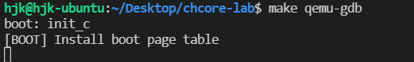

# 实验 2:内存管理 实验报告

### 思考题 1：请思考多级页表相比单级页表带来的优势和劣势（如果有的话），并计算在 AArch64 页表中分别以 4KB 粒度和 2MB 粒度映射 0～4GB 地址范围所需的物理内存大小（或页表页数量）。

#### 优势:

在虚拟内存地址没有全部映射到物理内存时节约页表占用的内存;

#### 劣势:

查表时需要多次访问内存(访问内存的次数等于页表级数)，查表效率降低，如单级页表查表时只需要访问一次内存(TLB没有命中的情况下), 4级页表则需要四次访问内存;

在虚拟内存映射到物理内存比例较高时页表反而会占用更多内存;

### 练习题 2：请在 `init_boot_pt` 函数的 `LAB 2 TODO 1` 处配置内核高地址页表（`boot_ttbr1_l0`、`boot_ttbr1_l1` 和 `boot_ttbr1_l2`），以 2MB 粒度映射
思路：将````PHYSMEM_START ~ PHYSMEM_END````范围的物理地址````paddr````分别映射到````vaddr = paddr + KERNEL_VADDR````位置的虚拟地址处。

````c
  /* Step 1: set L0 and L1 page table entry */
  u64 paddr = PHYSMEM_START;
  boot_ttbr1_l0[GET_L0_INDEX(paddr + KERNEL_VADDR)] =
      ((u64)boot_ttbr1_l1) | IS_TABLE | IS_VALID | NG;
  boot_ttbr1_l1[GET_L1_INDEX(paddr + KERNEL_VADDR)] =
      ((u64)boot_ttbr1_l2) | IS_TABLE | IS_VALID | NG;
  /* Step 2: map PHYSMEM_START ~ PERIPHERAL_BASE with 2MB granularity */
  for (; paddr < PERIPHERAL_BASE; paddr += SIZE_2M)
    boot_ttbr1_l2[GET_L2_INDEX(paddr + KERNEL_VADDR)] =
        (paddr)          /* high mem, va = pa + KERNEL_VADDR */
        | UXN            /* Unprivileged execute never */
        | ACCESSED       /* Set access flag */
        | NG             /* Mark as not global */
        | INNER_SHARABLE /* Sharebility */
        | NORMAL_MEMORY  /* Normal memory */
        | IS_VALID;
  /* Step 3: map PERIPHERAL_BASE ~ PHYSMEM_END with 2MB granularity */
  for (paddr = PERIPHERAL_BASE; paddr < PHYSMEM_END; paddr += SIZE_2M)
    boot_ttbr1_l2[GET_L2_INDEX(paddr + KERNEL_VADDR)] =
        (paddr)         /* high mem, va =  pa + KERNEL_VADDR */
        | UXN           /* Unprivileged execute never */
        | ACCESSED      /* Set access flag */
        | NG            /* Mark as not global */
        | DEVICE_MEMORY /* Device memory */
        | IS_VALID;
````


### 思考题 3：请思考在 `init_boot_pt` 函数中为什么还要为低地址配置页表，并尝试验证自己的解释。
在打开MMU的过程中，CPU还是按照地址顺序一条接着一条去获取指令，也就是说此时PC指针还是指向初始化代码的物理地址（即低地址）。当MMU打开之后，如果没有低地址直接映射的话，PC指针此时还是指向这段代码区域的物理地址，但打开MMU后CPU会把PC指针的地址当作虚拟地址进行操作，造成找不到对应的物理地址。如果做了低地址的恒等映射，虚拟地址和物理地址一致，CPU会把PC指针的地址当作虚拟地址进行操作，最终仍会映射到相同的物理地址上。

验证: 
注释掉低地址映射后重新编译并使用GDB运行

程序输出````[BOOT] Install boot page table````后卡住, 使用GDB发现程序报错````Cannot access memory at address 0x200````, 表明在不进行低地址映射的情况下启用MMU会导致CPU无法正常访问低地址程序指令




### 练习题 4：完成 `kernel/mm/buddy.c` 中的 `split_page`、`buddy_get_pages`、`merge_page` 和 `buddy_free_pages` 函数中的 `LAB 2 TODO 2` 部分，其中 `buddy_get_pages` 用于分配指定阶大小的连续物理页，`buddy_free_pages` 用于释放已分配的连续物理页

````split_page````思路: 使用递归函数, 当且仅当page的order等于需要的页的order时返回page, 否则将page一分为二, 将得到的buddy chunk放入pool的对应order处, 对order减一(大小减半)后的page继续递归调用````split_page````
````c
static struct page *split_page(struct phys_mem_pool *pool, u64 order, struct page *page) {
  if (page->order == order) return page;
  page->order--;
  struct page *pg_new = get_buddy_chunk(pool, page);
  pg_new->allocated = 0;
  pg_new->order = page->order;
  list_add(&(pg_new->node), &(pool->free_lists[page->order].free_list));
  pool->free_lists[page->order].nr_free++;
  return split_page(pool, order, page);
}
```` 

````buddy_get_pages````思路:首先找到pool中order不小于所需order的最小页, 将其从pool中删除, 调用````split_page````将其分割得到正好（即````page->order == order````）的页, 多余的buddy放入pool中的对应位置

````c
struct page *buddy_get_pages(struct phys_mem_pool *pool, u64 order) {
  struct page *pg = NULL;
  for (u64 od = order; od < BUDDY_MAX_ORDER; od++)
    if (pool->free_lists[od].nr_free > 0) {
      pg = list_entry(pool->free_lists[od].free_list.next, struct page, node);
      list_del(&(pg->node));
      init_list_head(&pg->node);
      pool->free_lists[od].nr_free--;
      pg = split_page(pool, order, pg);
      pg->allocated = 1;
      break;
    }
  return pg;
}
````

````merge_page````思路:使用````get_buddy_chunk````找到该页的buddy chunk, 如果该chunk和page order相同且没有被使用则将该buddy页从内存中删除并和page合并, 递归调用直至page无法和buddy合并, 将得到的merge后的页返回

````c
static struct page *merge_page(struct phys_mem_pool *pool, struct page *page) {
  struct page *pg = get_buddy_chunk(pool, page);
  if (!pg || pg->order != page->order || page->order == BUDDY_MAX_ORDER - 1 ||
      pg->allocated)
    return page;
  list_del(&pg->node);
  init_list_head(&pg->node);
  pool->free_lists[pg->order].nr_free--;
  struct page *pg_new = (pg < page) ? pg : page;
  pg_new->order++;
  return merge_page(pool, pg_new);
}
````

### 练习题 5 & 6：完成 `kernel/arch/aarch64/mm/page_table.c` 中的 `query_in_pgtbl`、`map_range_in_pgtbl`、`unmap_range_in_pgtbl` 函数中的 `LAB 2 TODO 3` 部分，分别实现页表查询、映射、取消映射操作.在上一个练习的函数中支持大页（2M、1G 页）映射，可假设取消映射的地址范围一定是某次映射的完整地址范围，即不会先映射一大块，再取消映射其中一小块

````query_in_pgtbl````思路:

从level0开始一直到level3调用````get_next_ptp````, 获取next_ptp(在循环尾使用next_ptp更新current_ptp), 如果函数返回-ENOMAPPING表明该地址尚未被映射, 如果在level1或level2循环内返回BLOCK_PTP表明此地址处为大页映射, 组成物理地址后直接返回, 四次循环后如果函数尚未返回表明没有使用大页映射, 则组成物理地址后直接返回. 不同页大小（对应不同level）对应的INDEX_SHIFT和OFFSET位数不同.

````c
int query_in_pgtbl(void *pgtbl, vaddr_t va, paddr_t *pa, pte_t **entry) {
  ptp_t *next_ptp, *current_ptp = (ptp_t *)pgtbl;
  pte_t *pte;
  for (int level = 0; level <= 3; level++, current_ptp = next_ptp) {
    int ret = get_next_ptp(current_ptp, level, va, &next_ptp, &pte, false);
    if (ret == -ENOMAPPING) return -ENOMAPPING;
    if (ret == BLOCK_PTP) {
      if (level == 1) {
        *entry = pte;
        *pa =
            (((u64)pte->l1_block.pfn) << L1_INDEX_SHIFT) | GET_VA_OFFSET_L1(va);
        return 0;
      } else if (level == 2) {
        *entry = pte;
        *pa =
            (((u64)pte->l2_block.pfn) << L2_INDEX_SHIFT) | GET_VA_OFFSET_L2(va);
        return 0;
      }
    }
  }
  // assert(ret == NORMAL_PTP)
  *entry = pte;
  *pa = (((u64)pte->l3_page.pfn) << L3_INDEX_SHIFT) | GET_VA_OFFSET_L3(va);
  return 0;
}
````

````map_range_in_pgtbl````思路:
使用````get_next_ptp````(````alloc = true````)循环逐级创建下级页表, 使用````pte = &current_ptp->ent[GET_L3_INDEX(va + index)]````获取L3级页表, 之后将其````pfn````和````is_page````和````is_valid````设置后返回

````c
int map_range_in_pgtbl(void *pgtbl, vaddr_t va, paddr_t pa, size_t len,
                       vmr_prop_t flags) {
  ptp_t *next_ptp, *current_ptp = (ptp_t *)pgtbl;
  pte_t *pte;
  u64 index;
  for (current_ptp = (ptp_t *)pgtbl, index = 0; index < len;
       index += PAGE_SIZE, current_ptp = (ptp_t *)pgtbl) {
    for (int level = 0; level < 3; level++, current_ptp = next_ptp)
      get_next_ptp(current_ptp, level, va + index, &next_ptp, &pte, true);

    pte = &current_ptp->ent[GET_L3_INDEX(va + index)];
    pte->l3_page.pfn = (pa + index) >> L3_INDEX_SHIFT;
    pte->l3_page.is_page = 1;
    pte->l3_page.is_valid = 1;
    set_pte_flags(pte, flags, USER_PTE);
  }
  return 0;
}
````
````map_range_in_pgtbl_huge````思路:
采用先大页后小页的思路, 如果len大于1个1G大页大小则首先使用1G大页创建页表项映射, 之后调整va、pa和len(具体为va和pa加上使用大页映射的长度, len减去使用大页映射的长度), 最后使用小页普通映射映射剩余长度。

不同页大小的映射对应不同页表级数（具体对应程序创建页表项部分的循环次数）和不同INDEX_SHIFT。

各级页表操作细节与````map_range_in_pgtbl````相似, 但是````is_page````设置为0表示直接大页映射

````c
int map_range_in_pgtbl_huge(void *pgtbl, vaddr_t va, paddr_t pa, size_t len, vmr_prop_t flags) {
  ptp_t *next_ptp, *current_ptp = (ptp_t *)pgtbl;
  pte_t *pte;
  u64 index;
  if (GET_VA_OFFSET_L1(va) == 0 && GET_VA_OFFSET_L1(pa) == 0 &&
      len / L1_PAGE_SIZE) {
    for (index = 0; index < L1_RANGE_LENGTH(len);
         index += L1_PAGE_SIZE, current_ptp = (ptp_t *)pgtbl) {
      for (int level = 0; level < 1; level++, current_ptp = next_ptp)
        get_next_ptp(current_ptp, level, va + index, &next_ptp, &pte, true);

      pte = &current_ptp->ent[GET_L1_INDEX(va + index)];
      pte->l1_block.pfn = (pa + index) >> L1_INDEX_SHIFT;
      pte->l1_block.is_table = 0;
      pte->l2_block.is_valid = 1;
      set_pte_flags(pte, flags, USER_PTE);
    }
    va += L1_RANGE_LENGTH(len);
    pa += L1_RANGE_LENGTH(len);
    len %= L1_PAGE_SIZE;
  }
  if (GET_VA_OFFSET_L2(va) == 0 && GET_VA_OFFSET_L2(pa) == 0 &&
      len / (L2_PER_ENTRY_PAGES * PAGE_SIZE)) {
    for (current_ptp = (ptp_t *)pgtbl, index = 0; index < L2_RANGE_LENGTH(len);
         index += L2_PAGE_SIZE, current_ptp = (ptp_t *)pgtbl) {
      for (int level = 0; level < 2; level++, current_ptp = next_ptp)
        get_next_ptp(current_ptp, level, va + index, &next_ptp, &pte, true);
      pte = &current_ptp->ent[GET_L2_INDEX(va + index)];
      pte->l2_block.pfn = (pa + index) >> L2_INDEX_SHIFT;
      pte->l2_block.is_table = 0;
      pte->l2_block.is_valid = 1;
      set_pte_flags(pte, flags, USER_PTE);
    }
    va += L2_RANGE_LENGTH(len);
    pa += L2_RANGE_LENGTH(len);
    len %= L2_PAGE_SIZE;
  }
  if (!len) return 0;
  for (current_ptp = (ptp_t *)pgtbl, index = 0; index < len;
       index += PAGE_SIZE, current_ptp = (ptp_t *)pgtbl) {
    for (int level = 0; level < 3; level++, current_ptp = next_ptp)
      get_next_ptp(current_ptp, level, va + index, &next_ptp, &pte, true);

    pte = &current_ptp->ent[GET_L3_INDEX(va + index)];
    pte->l3_page.pfn = (pa + index) >> L3_INDEX_SHIFT;
    pte->l3_page.is_page = 1;
    pte->l3_page.is_valid = 1;
    set_pte_flags(pte, flags, USER_PTE);
  }
  return 0;
}
````

````unmap_range_in_pgtbl````思路:
与````map_range_in_pgtbl````思路相似, ````unmap_range_in_pgtbl````首先获取对应地址的L3页表, 将对应页表项各位设为0即可
````c
int unmap_range_in_pgtbl(void *pgtbl, vaddr_t va, size_t len) {
  /* LAB 2 TODO 3 BEGIN */
  ptp_t *next_ptp, *current_ptp = (ptp_t *)pgtbl;
  pte_t *pte;
  u64 index;
  for (current_ptp = (ptp_t *)pgtbl, index = 0; index < len;
       index += PAGE_SIZE, current_ptp = (ptp_t *)pgtbl) {
    for (int level = 0; level < 3; level++, current_ptp = next_ptp)
      get_next_ptp(current_ptp, level, va + index, &next_ptp, &pte, false);
    pte = &current_ptp->ent[GET_L3_INDEX(va + index)];
    memset(pte, 0, sizeof(pte_t));
  }
  return 0;
}
````

````unmap_range_in_pgtbl_huge````思路:

与````map_range_in_pgtbl_huge````思路相似, ````unmap_range_in_pgtbl_huge````首先将可以使用大页映射的部分unmap, 最后将使用普通映射的部分unmap, unmap时对应页表项各位设为0即可

````c
int unmap_range_in_pgtbl(void *pgtbl, vaddr_t va, size_t len) {
  ptp_t *next_ptp, *current_ptp = (ptp_t *)pgtbl;
  pte_t *pte;
  u64 index;
  if (GET_VA_OFFSET_L1(va) == 0 && len / L1_PAGE_SIZE) {
    for (u64 index = 0; index < L1_RANGE_LENGTH(len);
         index += L1_PAGE_SIZE, current_ptp = (ptp_t *)pgtbl) {
      for (int level = 0; level < 1; level++, current_ptp = next_ptp)
        get_next_ptp(current_ptp, level, va + index, &next_ptp, &pte, false);
      pte = &current_ptp->ent[GET_L1_INDEX(va + index)];
      memset(pte, 0, sizeof(pte_t));
    }
    va += L1_RANGE_LENGTH(len);
    len %= L1_PAGE_SIZE;
  }
  if (GET_VA_OFFSET_L2(va) == 0 && len / L2_PAGE_SIZE) {
    for (current_ptp = (ptp_t *)pgtbl, index = 0; index < L2_RANGE_LENGTH(len);
         index += L2_PAGE_SIZE, current_ptp = (ptp_t *)pgtbl) {
      for (int level = 0; level < 2; level++, current_ptp = next_ptp)
        get_next_ptp(current_ptp, level, va + index, &next_ptp, &pte, false);
      pte = &current_ptp->ent[GET_L2_INDEX(va + index)];
      memset(pte, 0, sizeof(pte_t));
    }
    va += L2_RANGE_LENGTH(len);
    len %= L2_PAGE_SIZE;
  }
  if (!len) return 0;
  for (current_ptp = (ptp_t *)pgtbl, index = 0; index < len;
       index += PAGE_SIZE, current_ptp = (ptp_t *)pgtbl) {
    for (int level = 0; level < 3; level++, current_ptp = next_ptp)
      get_next_ptp(current_ptp, level, va + index, &next_ptp, &pte, false);
    pte = &current_ptp->ent[GET_L3_INDEX(va + index)];
    memset(pte, 0, sizeof(pte_t));
  }
  return 0;
}
````


### 思考题 7：阅读 Arm Architecture Reference Manual，思考要在操作系统中支持写时拷贝（Copy-on-Write，CoW）需要配置页表描述符的哪个/哪些字段，并在发生缺页异常（实际上是 permission fault）时如何处理。

设置AP(bits[7:6])位为只读,

发生缺页异常时系统将该虚拟内存对应的物理内存页在其他位置复制一份,之后将页表上该虚拟内存对应的物理内存地址修改为复制后的内存页的物理内存地址, 修改页表描述符AP位为可读可写, 之后程序可以修改该虚拟地址处的内存页

### 思考题 8：为了简单起见，在 ChCore 实验中没有为内核页表使用细粒度的映射，而是直接沿用了启动时的粗粒度页表，请思考这样做有什么问题。

使用粗粒度页表使得分配内存时只能采用大页分配，在程序不需要使用大页大小的内存时增加内存内部碎片，使内存利用率降低，增加内存浪费

### 挑战题 9：使用前面实现的 `page_table.c` 中的函数，在内核启动后重新配置内核页表，进行细粒度的映射


